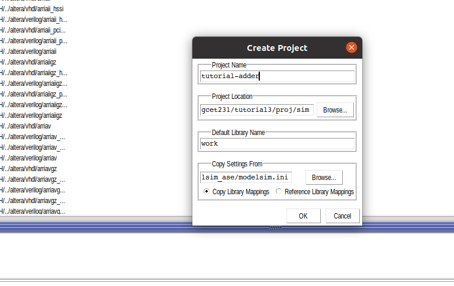
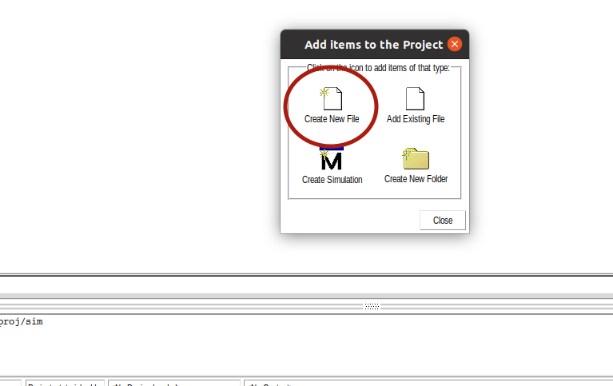
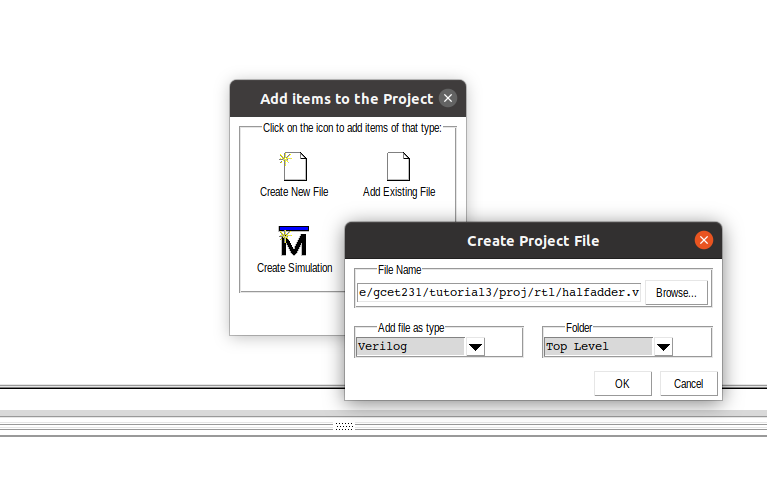
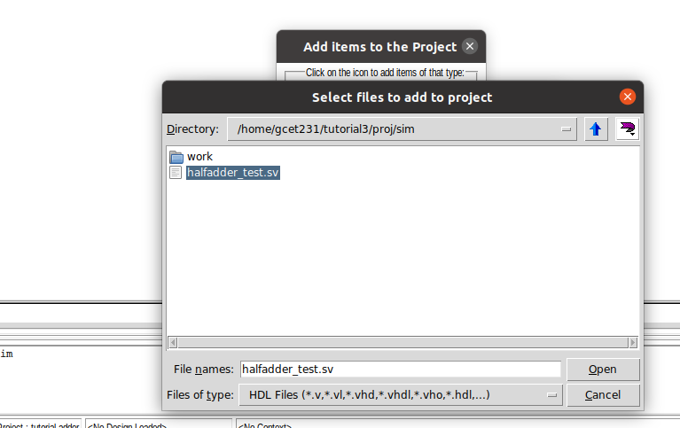
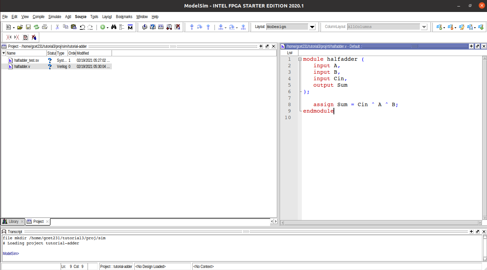
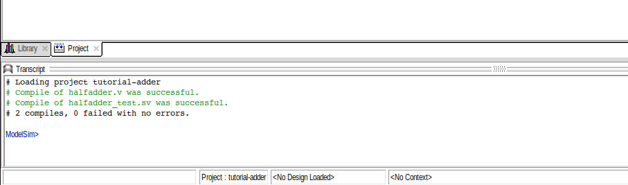
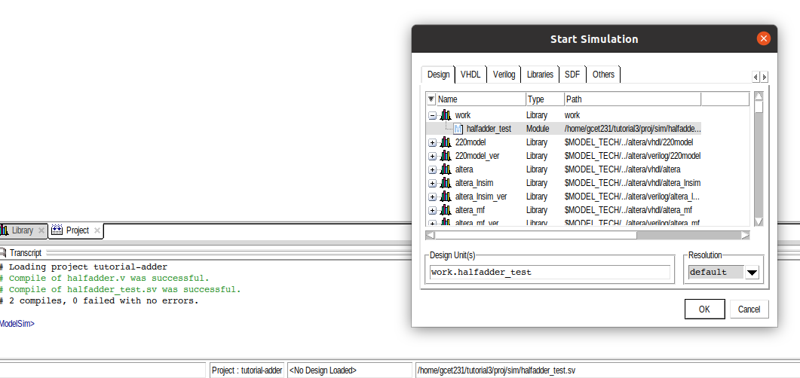
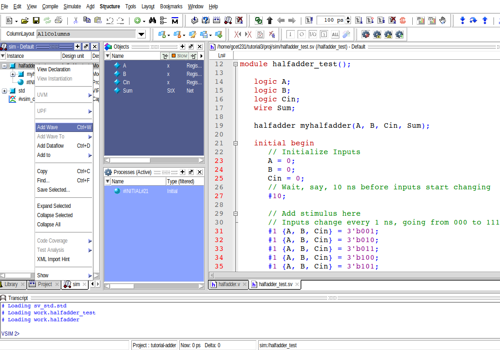
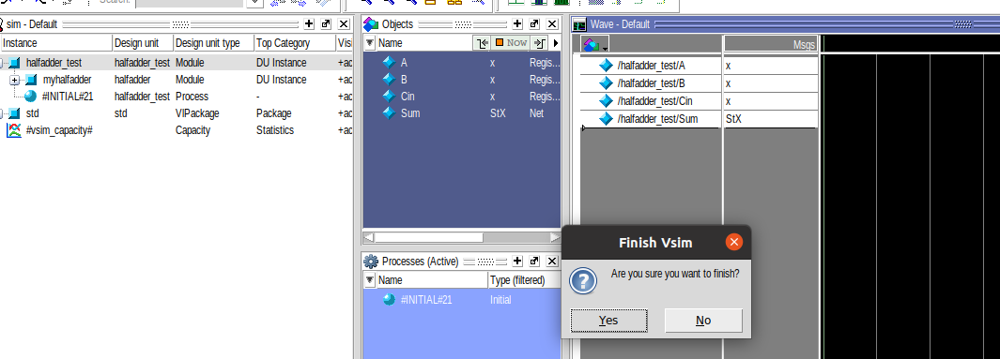
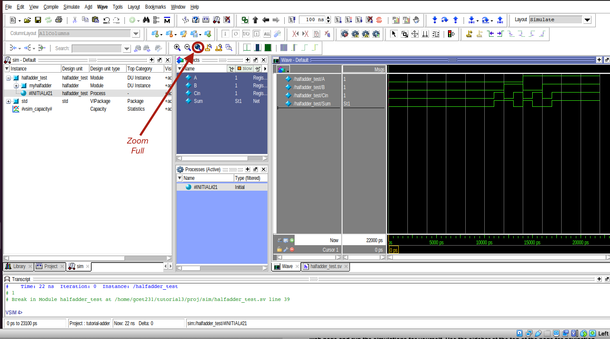

# Tutorial de Simulação Utilizando o ModelSim

Neste tutorial você irá projetar um circuito combinacional de três entradas e uma saída. O circuito trata de um Meio Somador de um bit, cujas entradas são _A_, _B_ e o _Carry_, e a saída _Sum_.

O procedimento adotado neste tutorial consistem em fazer o seguinte:

- Criar um novo projeto no ModelSim;
- Adicionar um arquivo Verilog que descreve o circuito Meio Somador;
- Adicionar um arquivo SystemVerilog que fornece os estímulos de entrada (_test bench_);
- Simular o circuito Meio Somador;
- Observar as saídas e verificar se elas estão corretas;

## Criando um projeto

Crie uma pasta no seu computador onde você irá criar o novo projeto. Certifique-se de que não haja espaços no caminho para os arquivos!

Utilize a estrutura de diretórios a seguir para completar esse tutorial.

- `sim`: diretório onde serão armazenados os arquivos de simulação e projetos do ModelSim.
- `src`: diretório onde serão armazenados os arquivos Verilog.

Abra o ModelSim clicando duas vezes no ícone da sua área de trabalho, localizando no menu de programas ou digitando o comando `vsim &` no terminal do Linux, e crie um novo projeto Clicando no menu `File -> New -> Project`.

Você verá uma janela semelhante à que é apresentada abaixo. Escolha onde o seu novo projeto será armazenado. Para o nosso tutorial escolheremos: `caminho/para/a/pasta/gcet231/tut3-simulacao-hdl/sim/modelsim`. Chamaremos esse projeto de _tutorial-adder_. Projetos criados pelo ModelSim possuem a extensão `.prj`. Deixe as outras configurações com as opções padrão.



## Criando um Arquivo Verilog dentro do Projeto

No momento em que você cria um novo projeto no ModelSim, uma janela semelhante à que é apresentada abaixo é aberta. Clique em `Create New File`. Isso fará com que a ferramenta crie um novo arquivo em branco.

> 💁 Você pode criar ou adicionar novos arquivos ao projeto depois através do menu principal do ModelSim.



Na janela que segue chame seu arquivo de `halfadder` e salve-o dentro do diretório `src`. Na opção **Add file as type** escolha `Verilog`.



> Antes de seguir adiante, copie o arquivo [`halfadder_test.sv`](../proj/sim/halfadder_test.sv) dentro do diretório `sim/tb` no seu computador.

De volta para a janela de criação do projeto, clique em `Add Existing File`. Navegue até o diretório `sim` e adicione o arquivo [`halfadder_test.sv`](../proj/sim/halfadder_test.sv) ao seu projeto. Mantenha as demais configuração com seus valores padrão. Clique em `OK` quando finalizar.



Agora, vamos escrever nosso primeiro arquivo Verilog. Clique duas vezes para abrir o arquivo `halfadder.v` e preencha a descrição com o código apresentado a seguir:

```verilog
module halfadder (
   input  A,
   input  B,
   input  Cin,
   output Sum
);

   assign Sum = Cin ^ A ^ B;
endmodule
```

Note que `^` é o símbolo para a operação ou-exclusivo (XOR). Este fragmento de código corresponde à equação Booleana extraída da Tabela Verdade do meio somador. Não esqueça de salvar o arquivo antes de continuar.



Agora observe aquelas duas interrogações azuis na janela `Project` da figura acima. A presença desse símbolo significa que o ModelSim não compilou os arquivos ainda.

> 💁 A interrogação pode aparecer também para indicar que os arquivos foram modificados desde a última compilação.

Você pode compilar os códigos clicando com o botão direito em `halfadder.v`, em seguida selecionando `Compile -> Compile All`. Você deve visualizar algumas mensagem na janela `Console` em verde indicando que a compilação foi bem sucedida.



> 💁 A ferramenta indica erros de sintaxe no código em vermelho. Para corrigir, verifique **TODAS** as mensagens, partindo da primeira.

Para iniciar sua simulação, clique em `Simulate` na barra de menus principal, então clique em `Start Simulation`. Isso fará com que seja aberta a janela de simulação. Procure pelo item `work -> halfadder_test` e clique em `OK`.



Após iniciada, a simulação está pronta e aguardando os próximos comandos. Agora vamos nos concentrar na visualização de forma de onda do ModelSim. A janela de forma de ondas (_Waveform_) apresenta formas de onda (0's e 1's binários, dígitos em hexadecimal ou decimal, tipos enumerados, etc.) para todos os sinais do seu circuito. Ele representa como seu circuito reage aos diferentes estímulos de entrada apresentados no _test bench_.

Nesse tutorial, vamos monitorar todos os sinais do _test bench_. Para isso, clique com o botão direito em `halfadder_test` e em seguida `Add Wave`. Isso criará uma instância de forma de onda para sua simulação. Em projetos mais complexos, você poderá criar várias janelas para analisar componentes diferentes do circuito.

> 💁 Você também pode clicar e arrastar sinais da janela **Objects** diretamente para a janela de **Wave** do ModelSim.



Note agora que todos os sinais presentes dentro do _test bench_ foram adicionados. Para executar a simulação clique no ícone com um pequeno pedaço de papel e uma seta apontada para baixo, modificando antes o tempo de simulação para `100 ns`. Ao final da simulação, uma janela deve se abrir perguntando se deseja encerrar a simulação. Clique em **NO**. Caso contrário, sua simulação será encerrada.



O procedimento acima fará com que sua simulação seja executada por 100 nanosegundos. Entretanto, observe que o tempo de simulação estipulado no _test bench_ é menor. Para visualizar toda a forma de onda, clique no botão `Zoom Full`, indicado na figura abaixo. Agora observe os sinais alternando!



Parabéns! Você acabou de criar sua primeira simulação no ModelSim!

---

## 🧑‍💻 Pagando pra ver

> Não acredita que o processo de simulação poderia ser tão fácil? Elabore a tabela verdade do circuito meio somador e confronte o resultado encontrado com aquele produzido pela simulação.

## Considerações

Esse tutorial mostrou como criar seu próprio projeto no ModelSim, adicionar arquivos (novos e existentes), compilar seus arquivos, iniciar sua própria simulação e visualizar as formas de onda do teste.

Agora você está pronto para explorar todos os recursos do ModelSim e desenvolver seus próprios projetos.
